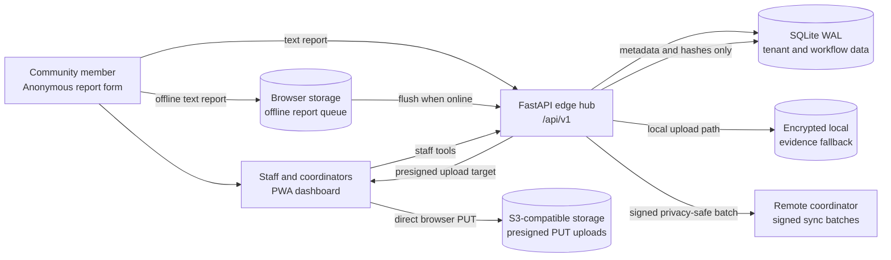
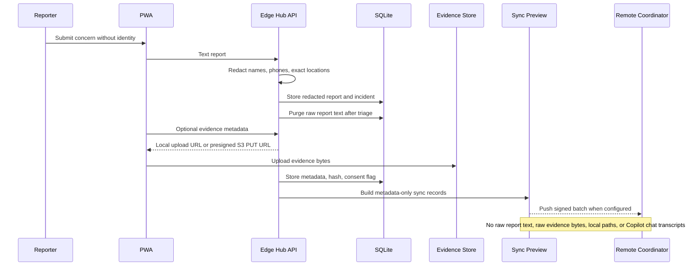
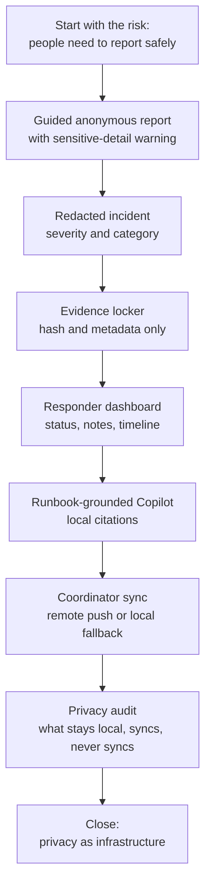

# PeacePulse Architecture Diagrams

These diagrams are meant for quick explanation in reviews, demos, and the five-minute pitch. They describe the current implementation, not the older background ideation document.

## System Architecture

## Privacy-safe Data Flow

## Five-minute Demo Flow

